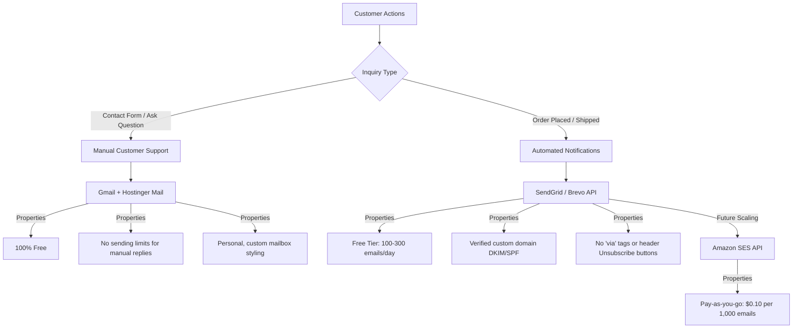

# Cozy Aura — Email Strategy & Infrastructure Plan

This document outlines the professional, cost-effective transactional and customer support email strategy for Cozy Aura.

---

## 📋 The Strategy

---

## 🛠️ Infrastructure Overview

### 1. Manual Customer Support (Hostinger Webmail / Gmail)
* **Purpose**: Responding manually to pre-sale questions, custom orders, or customer support inquiries.
* **Mechanism**: Use your Hostinger custom domain mailbox (or Gmail linked to Hostinger SMTP).
* **Benefits**: 
  * **100% Free** with your hosting plan.
  * No daily sending limits for normal manual correspondence.
  * Direct and personal interaction.

### 2. Automated Transactions (SendGrid / Brevo / Resend)
* **Purpose**: Automated order confirmations, invoices, and shipping tracking updates sent instantly when a customer checks out.
* **Mechanism**: Cloudflare Workers outbound HTTP API calls (fully compatible with Worker sandbox limits).
* **Setup Requirements (Mandatory for Professional Styling)**:
  * **Domain Verification**: Add DKIM and SPF records (provided by SendGrid/Brevo) to your Hostinger DNS panel.
  * **The Result**: Wipes out the `via sendgrid.net`/`via brevosend.com` label and removes Gmail's header-level "Unsubscribe" button entirely.

### 3. Future Scale (Amazon SES)
* **Purpose**: Seamless backend transition once store traffic exceeds 100–300 orders/day.
* **Cost**: $0.10 (approx. ₹8.50) per 1,000 emails. (No monthly subscription or minimum charge).
* **Transition**: The codebase is already optimized to support REST API transitions.

---

## ⚙️ DNS Configuration Checklist (When Domain is Ready)

When you authenticate your custom domain (e.g. `cozyaura.in` or `cozyaura.com`), add the following records to your domain's DNS Zone File in Hostinger:

1. **SPF Record**: Authorized sending source.
2. **DKIM Record**: Cryptographic signature validation.
3. **DMARC Record**: Policy validation (protects your domain from being spoofed).
